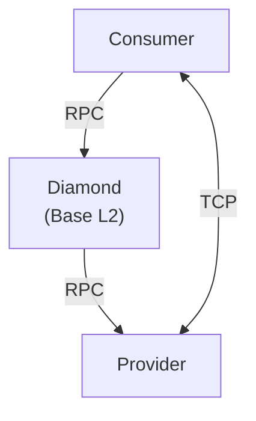
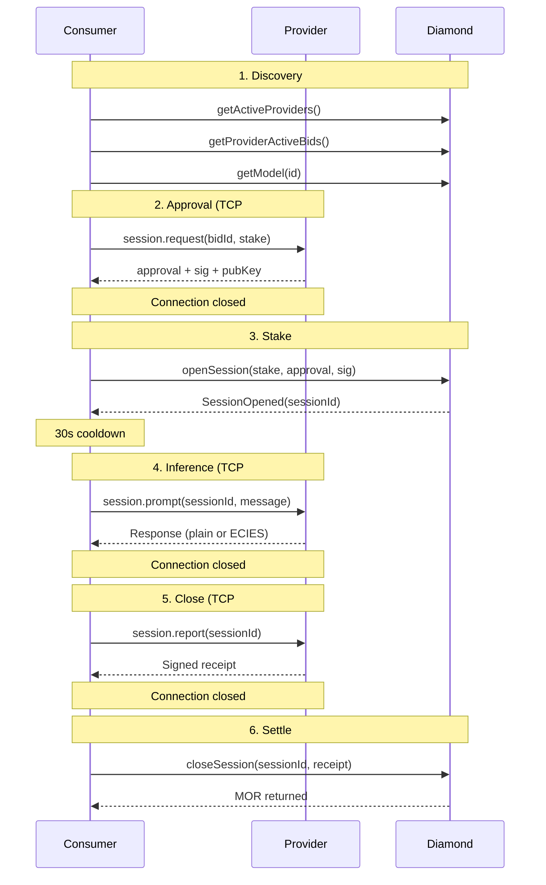

# MRC 93: Compute Subnet Protocol & Provider Standards

| Field | Value |
|-------|-------|
| **Title** | MRC 93 - Compute Subnet Protocol & Provider Standards |
| **Author(s)** | Robert Christian, DRM3 Labs ([x.com/Drm3Labs](https://x.com/Drm3Labs)) |
| **Category** | Compute (MRI #3) |
| **Dependencies** | MRC05 (Yellowstone), MRC25 (Lake Travis), MRC57 (Deployment) |
| **New Weights Requested** | 0 (specification only).  A follow-up MRC will scope implementation of companion artifacts with appropriate weights. |
| **Existing Weights** | N/A |
| **Status** | Under Discussion |

**Summary:** Defines minimum standards for protocol documentation, contract deployment transparency, provider response contracts, provider accountability, and governance for the Morpheus compute subnet.  Based on findings from building an independent Rust consumer node (Pistachio) against the live network.

**Rationale:** The Morpheus compute subnet relies on undocumented runtime protocols, contract deployments with no published mapping between on-chain bytecode and source tags, and providers with no protocol-level accountability requirements.  The only proof that the system works today is that a single vendor's consumer and provider nodes function together, not because they adhere to a spec, but because they are the same codebase.  The runtime protocol between consumer and provider involves more complexity than the on-chain contract interaction, yet it is the part with the least documentation.  This creates unnecessary friction for builders and limits ecosystem growth beyond the Go reference implementation.

**Value Proposition:** A documented, versioned protocol unlocks ecosystem growth that a single-implementation network cannot achieve.  Builders in any language can implement consumer or provider nodes without reverse-engineering Go source.  Consumers get structured error handling and provider quality data for informed staking decisions.  More implementations means more resilience, more language communities contributing, more adoption paths, and a network that does not depend on a single codebase for its survival.

**Deliverables:** Protocol specification, provider registration requirements, response schema, quality metrics standard, governance framework.

**Background:** DRM3 Labs builds Pistachio (Rust consumer node), Cashew (Morpheus blockchain explorer), and related infrastructure.  Active on the Morpheus compute subnet since early 2026.  Pistachio is the first non-Go consumer implementation on the network.  DRM3 wallets are the second and third most active consumers on the compute subnet by session volume, behind only the core Morpheus consumer.

## Context

This MRC identifies gaps in the Morpheus compute subnet and proposes concrete, incremental standards to close them.  The goal is to reduce non-determinism, lower the barrier for new builders, and make the network more resilient through client diversity.  Nothing here conflicts with permissionless participation.  The proposals are organized from low-cost immediate wins to longer-term coordination efforts.

Pistachio is a Rust consumer node for Morpheus decentralized AI inference.  It talks directly to the Diamond contract on Base and communicates with providers over the MOR RPC protocol.  Users stake MOR, open sessions, run inference, close sessions, and get MOR back.

Building it required reverse-engineering the Go reference implementation (proxy-router): guessing which contract tag is deployed, matching TCP behavior to a moving codebase, and debugging ECIES failures with no test vectors.  None of this effort was inherent to the problem.  It was the cost of building against undocumented infrastructure.  That cost compounds for every independent builder.  The **TCP wire protocol, ECIES encryption parameters, signature field ordering, and session close requirements** were all discovered through source code reading and live testing.  Documentation around these things is largely absent.  Where documentation does exist, it is sometimes outdated or contradicted by actual on-chain behavior.  There is no single canonical source for protocol truth, no clear distinction between which repos or sites are current, and no governance sign-off indicating that a given document reflects the actual deployed state of the system.

**This MRC proposes six areas of standardization that would benefit all current and future builders on the compute subnet.**



Both sides interact with the same Diamond contract via RPC.  Consumer and provider communicate directly over TCP using the MOR RPC protocol.

**Where things stand today.**

- Morpheus requires that providers run specific infrastructure (proxy-router) and that consumers interoperate with it over a TCP protocol.  Both sides must be compatible.
- The contract ABI exists and the source is in a public repo.  The gap is determinism: there is no reliable way to know which tag or commit is deployed to mainnet at any given time (Proposal I).
- **The TCP protocol between consumer and provider is not specified at all.**  It exists only as behavior in a fluidly changing Go codebase.  The entire flow of encryption, key exchange, framing, field ordering, and connection lifecycle must be reverse-engineered from Go source.  There is no spec, no test suite, and no certification to validate against.
- A builder who wants to write a consumer or provider in any other language has no choice but to read Go source and replicate its behavior exactly, knowing that the source can change without notice.

The distinction matters: a protocol can be implemented independently.  A single implementation cannot.

**Why multiple implementations matter.**  A network that depends on a single codebase for both sides of a protocol has a single point of failure.  Ethereum runs on multiple client implementations (Geth, Nethermind, Besu, Erigon) specifically because client diversity prevents a single bug from taking down the entire network.  The Ethereum Foundation actively funds alternative clients for this reason.  Bitcoin has the same pattern (Bitcoin Core, btcd, libbitcoin).  Today, the Morpheus compute subnet has one consumer implementation (Go) and one provider implementation (Go).  Every consumer and every provider runs the same code.  **A single bug in proxy-router affects 100% of providers.  An undocumented change to the provider implementation silently breaks any independent consumer.**  Pistachio is the first independent consumer implementation.  The network is stronger with it than without it, but only if the protocol is specified well enough for independent implementations to stay compatible without copying Go source line by line.

---

## I. Contract Deployment Transparency

*Extends MRC57 (Best Practice Stages for Deployment)*

**The problem.**
- The Diamond contract is upgradeable (EIP-2535).  Source code and tags exist in the repo, but there is no published process for knowing which tag or commit corresponds to what is actually deployed on mainnet.
- There is **no deterministic way** to know which source code matches the deployed bytecode.  The best available method is to match the on-chain deploy timestamp to the most recent commit on main, compile it, compare ABI selectors, and hope they match.
- Every uncertainty forces builders to test beyond their assumptions to compensate.  All of this is avoided with trusted processes and governance sign-offs.  They do not exist today.

**What this prevents.**
- Builders cannot plan for breaking changes
- Builders cannot test against a staging environment before mainnet deploys
- Builders cannot verify that their ABI bindings match what is actually deployed
- Any consumer or provider implementation can break silently when a facet is swapped

**What we do today.**  We vendor the Morpheus smart contract source, pin it to a GitHub tag, and run an ABI verification script against live on-chain selectors every two weeks.  We built DiamondCut event monitoring to detect upgrades within 5 seconds.  Even with all of this, the correct session close path (provider-signed receipt required, error `0x2e980d14` on user-signed attempts) was discovered only through on-chain reverts.  The contract source shows this was always the intended behavior, but it is not documented anywhere outside the Solidity code itself.

**Proposed standard.**
- Tag mainnet deployments in the Morpheus GitHub repo with the exact commit hash deployed
- Publish a contract upgrade schedule (even if approximate) so builders can plan
- Maintain a registry of current facet addresses and their source commits

---

## II. MOR RPC Protocol Specification

*Extends MRC05 (Yellowstone Compute Model), which defines the session/bid architecture but not the TCP wire protocol*

**The problem.**
- The TCP protocol between consumer and provider nodes has no formal specification.
- The only documentation is the Go source code of proxy-router.

**What this prevents.**
- Builders in any language other than Go must reverse-engineer the protocol from source code
- There is no way to validate an implementation without a live provider
- A single misunderstanding of an undocumented detail can cause months of silent failure

**What we discovered through implementation.**
- **Framing:** JSON message + newline character + TCP write-shutdown.  The connection does not stay open.
- **Timestamps:** Milliseconds, not seconds.  Getting this wrong produces valid-looking requests that providers silently reject.
- **Signature field ordering:** Must match Go struct serialization order (`user, key, spend, timestamp, bidid`).  No spec defines this.
- **ECIES encryption:** Provider responses may be encrypted using go-ethereum's ECIES implementation.  The HMAC tag must include the IV (`messageTag(Km, IV || ciphertext, s2)`).  We got this wrong because the Go source is ambiguous without the specific `concatKDF` context.  Without test vectors or a spec, the only way to find this was to debug live failures.
- **session.report:** Provider-signed close receipt is required for immediate MOR return.  User-signed close triggers a dispute (closeoutType=1) with a 24-hour MOR hold.  This is not documented in the session economics spec.
- **Streaming:** ECIES key exchange fails for streaming responses.  Chunked decryption produces errors.

**Cost of the gap.**  An undocumented ECIES detail caused silent inference failures that were difficult to diagnose.  Undocumented behaviors around session closing and payment flags, including a workaround for an undocumented funding-pool failure (Proposal VI), led to hundreds of MOR in unexpected losses across standard automated staking operations.  One undocumented issue led to a workaround that triggered a second undocumented cost.  These incidents demonstrate the real economic cost of operating without clear specifications.

**Proposed standard.**
- Publish a protocol specification covering methods (`session.request`, `session.prompt`, `session.report`), framing, field ordering, signature schemes, and ECIES parameters.  Documentation means more than a single high-level sequence diagram.  It means error codes, expected behavior for each failure mode, and multiple sequence diagrams covering the breadth of cases (happy path, provider timeout, session not found, ECIES failure, backend error, expired session close, dispute close).
- Document the full per-connection lifecycle: each protocol step uses a separate TCP connection with write-shutdown
- Document the post-`openSession` cooldown period (minimum 30 seconds, sometimes longer) before the provider accepts a new session
- Include test vectors for the ECIES implementation (key derivation, encryption, HMAC) so implementers in any language can validate their crypto
- Version the protocol using semantic versioning (e.g., MOR-RPC v1.0) so breaking changes can be detected and handled.  Consumer and provider should exchange protocol version on connection.

---

## III. Reference Test Suite

**The problem.**
- Every new consumer or provider implementation must reimplement the full MOR RPC protocol from scratch
- We built it in Rust.  A Python builder would start from zero.  A JavaScript builder would start from zero.
- Each will discover the same undocumented behaviors through the same trial-and-error process

**What this prevents.**
- Builders cannot validate their implementation offline
- The only way to test is against *live providers on mainnet*, which costs MOR to stake and risks real funds on untested code
- There is no staging, no testnet, no mock provider

**Precedent.**  The [Drummond Group](https://www.drummondgroup.com/services/as2-testing-and-certification/) has provided independent AS2 protocol conformance testing for over 25 years.  Vendors submit their implementations and receive certification that they interoperate correctly with other certified systems.  Major retailers (Walmart, Target, Amazon) require Drummond-certified AS2 solutions from their trading partners.  The model works: a published spec, a test suite, and independent certification.  MOR-RPC is a simpler protocol than AS2.  There is no reason it cannot have the same rigor.

**Proposed standard.**  One or both of:
- **Reference test suite:** A set of test cases (request/response pairs, signed messages, encrypted payloads) that any implementation can run offline to validate protocol compliance.  Language-agnostic, JSON-based.  This is the minimum viable version of what Drummond does for AS2.
- **Shared library:** Extract the TCP communication and ECIES crypto into a standalone library with a C ABI or WASM target.  Any consumer or provider in any language could link against it for the protocol layer.

---

## IV. Provider Response Standard

**The problem.**
- There is no defined standard for what a provider returns on success or failure
- Most providers are simply proxies to third-party backends.  They register a model name on-chain, point their proxy-router at a backend API, and pass through whatever comes back.
- The provider does not validate, wrap, or classify the response.  The consumer gets the raw output of someone else's infrastructure.
- A single provider could be routing to a mix of Venice, AWS, NVIDIA, and their own hardware behind the same endpoint, with no visibility into what is serving a given request
- Providers can add, remove, or swap backend models at any time.  A model that worked yesterday can return completely different behavior today because the provider changed what's behind it.  The consumer has no prior knowledge, no notification, and no recourse.

**What this prevents.**
- Consumers cannot build reliable retry logic, error attribution, or provider quality scoring
- Consumers cannot distinguish between "provider is broken," "backend is overloaded," and "your request is malformed"
- Consumers cannot route around failures because all failures look the same
- Consumers cannot build stable integrations because provider behavior is non-deterministic across time

**What we see in practice.**
- Venice backend returns HTTP 429 rate limit for the provider's own API quota.  Consumer receives this as a Morpheus inference error with no way to distinguish provider overload from consumer error.
- Provider returns "invalid signature" when the actual issue is payload size exceeding an undocumented limit.
- Thinking models consume all `max_tokens` on internal reasoning, return empty visible content.  Provider reports success with an empty body.  Consumer cannot distinguish empty output from a failure.
- Provider returns raw LiteLLM Python tracebacks as error messages.
- Models are registered with no context window declaration.  Our catalog lists 128K for most models, but this is unverified.  Actual context support varies wildly across providers and backends because the provider is just proxying to whatever backend they chose.  A consumer has no way to know the real context limit before hitting it.

**Proposed standard.**
- A defined response envelope: `{ "status": "ok" | "error", "data": ..., "error_code": "...", "error_source": "provider" | "backend" | "model" }`
- A finite set of provider error codes: `capacity_exceeded`, `model_not_found`, `invalid_request`, `backend_error`, `rate_limited`, `timeout`
- Clear separation between provider-level errors (session invalid, capacity full) and backend-level errors (model crashed, rate limited, empty output)
- Providers must classify errors before forwarding them.  Consumers should never receive raw backend stack traces through a protocol-level channel.
- Model bids should include declared context window, max output tokens, and supported capabilities.  Consumers should not have to guess what a model actually supports.
- Providers should update or invalidate their on-chain bid when they materially change the backend serving a registered model.  Repeated silent backend swaps that meaningfully alter behavior may be considered non-compliant.
- Include an optional `metadata` object in the response envelope for additional context (e.g., `backend_type`, `model_name`, `retry_after`).

---

## V. Provider Quality and Accountability

**The problem.**
- No mechanism for reporting provider issues
- No on-chain quality metrics
- No way for consumers to make informed staking decisions
- A provider can be intermittently broken, return errors 30% of the time, or silently drop requests
- The only recourse is to close the session and lose the staking window
- tech.mor.org shows provider uptime via simple pings.  A provider can respond to pings while failing actual inference requests.

**What this prevents.**
- Consumers cannot evaluate providers before staking
- Consumers cannot report issues to the provider directly
- Consumers cannot compare provider quality
- There is no feedback loop that incentivizes providers to improve

**Where do consumers go when something breaks?**
- The Morpheus Discord is a general community channel, not a support system
- It has no ticketing, no per-provider routing, no SLA tracking
- A consumer experiencing inference failures has no way to contact the provider, report the issue, or get resolution
- The provider is an anonymous address on-chain with a TCP endpoint
- There is no website, no support channel, no documentation, no contact information of any kind

**Ownership gap.**  When inference fails, responsibility is distributed across the contract layer, the provider, and the consumer.  Without clear boundaries, each layer can reasonably point to another, and no single entity owns the end-to-end experience.  A consumer with a TCP trace and a stake ID showing exactly what happened has **no defined channel to report it through and no process for resolution**.  Closing this gap requires both a protocol spec (Proposal II) and a provider communication channel (this proposal).

**Who hosts provider comms?**  Since providers can be anyone, you cannot expect each one to stand up their own support infrastructure.  Morpheus governance could facilitate a structured provider communication layer: a forum, ticketing board, or channel where consumers can post traces and tag providers by their on-chain identity.  Alternatively, this is infrastructure the community or a third party could build and operate.  Either way, it needs to exist.

**What we built ourselves.**
- Pistachio runs canary tests against every model on the network (20+ models, all providers)
- We track per-provider, per-model success rates, latency, and failure patterns
- We built model health tracking, canary history, and provider quality scoring
- **None of this exists at the protocol level.**  Every consumer has to build their own quality infrastructure from scratch.

We recognize the pseudonymous ethos of the network.  **None of this requires doxxing.**  Anonymity and accountability are not mutually exclusive.

A precedent already exists within Morpheus: **builder subnets write their website, brand image, and description directly to the blockchain.**  Providers register on-chain with an endpoint and bids, but there is no equivalent profile for support contact, software version, or documentation.  Extending the on-chain provider record with these fields would bring providers to the same level of transparency that builder subnets already have.

**Proposed standard.**
- **Mandatory (anon-compatible):** Providers must publish on-chain a support channel (email, Telegram, Discord, or any reachable contact method) and the exact software version they are running (e.g., proxy-router v0.4.2).  This information must be kept current.  Neither requires revealing identity.
- **Optional self-identification:** Providers who want to build reputation and attract consumers should be able to publish their website, team info, and infrastructure details.  Self-identified providers should benefit from higher visibility.  This is opt-in, not required.
- **Certification:** Morpheus governance or a community-led body should record that a provider has been tested and meets minimum standards.  This is a stamp that says "someone verified this provider responds to inference requests and has a working support channel."  Not a full audit.  A basic sanity check.
- **Quality metrics:** On-chain or off-chain provider quality metrics computed from actual session data (not pings): success rate, average latency, dispute rate.
- **Provider profile:** The Marketplace or a companion registry should support a provider profile that consumers can inspect before staking: models offered, software version, uptime history, support contact, dispute rate, certification status.
- **Reputation consequences:** Consider slashing or reputation penalties for providers with sustained high error rates or frequent disputes.
- **Positive incentives:** Certified providers get featured placement in official marketplace UIs, higher visibility in consumer discovery, and community recognition.  Compliance should be rewarded, not just enforced.

---

## VI. Governance and Enforcement

**The problem.**
- Proposals I through V define standards, but there is no governance body responsible for compute subnet quality
- Contract upgrades happen without review
- Providers register without verification
- Protocol changes ship without notice
- The community has no mechanism to flag, escalate, or resolve compute-specific issues
- **The provider funding pool can run dry.**  When this happens, *no sessions can be closed* because the contract cannot pay the provider.  We have hit this.  Consumer MOR gets locked until the pool is replenished, with no visibility into the pool balance and no warning before it empties.  This was not documented anywhere.  We discovered it when closes started reverting.
- MOR holdings are distributed unevenly, which is common in early-stage networks.  This makes funding pool governance especially important: replenishment decisions, threshold alerts, and pool balance transparency benefit from a defined process rather than ad hoc coordination.
- **Separation of concerns.**  When the same small set of entities maintains the reference implementations, operates providers, and publishes network health data, independent verification becomes difficult.  Runtime configurations and deploy platforms are not published.  A builder trying to replicate a health test or match infrastructure is flying blind, even with their own tooling.

**What this prevents.**
- Builders cannot plan for protocol changes
- Consumers cannot resolve disputes
- No one is accountable for provider quality
- The funding pool can silently drain, blocking all session closes network-wide, with no advance warning or mitigation path
- Independent verification of network health is not possible when the same entity controls the reference implementations and the status reporting

**Proposed standard (low-cost, implement first):**
- **Funding pool transparency:** The contract must expose the provider funding pool balance via a view function.  An event must be emitted when the balance drops below a threshold (e.g., 10% of recent payout volume).  Session close failures due to an empty pool must revert with a specific error code (`insufficient_pool_balance`), not a generic revert.
- **Protocol change notification:** Contract upgrades and TCP protocol changes should be announced 72 hours prior to mainnet deployment.  Absence of announcement does not prevent deployment, but invalidates compliance attestation for that release.  Git commit history is not a changelog.  A changelog is a versioned, tagged document that says "these selectors changed, this behavior is different, this is the minimum compatible provider version."  Without tags on deployed code, commit history is just a stream of changes with no anchor to what is actually running on mainnet.
- **Mandatory support contact as a registry field:** A single on-chain or registry field for provider contact info.  Low implementation cost, high impact.
- **Provider healthcheck requirement:** The proxy-router source already contains a `/healthcheck` endpoint (port 8082) that returns `status`, `version`, `uptime`, and `components`.  Require providers to expose this publicly and extend it to include MOR-RPC protocol version and Diamond facet compatibility.

**Proposed standard (higher coordination, implement iteratively):**
- **Compute Subnet Attestation Authority:** Designate a role (individual, multisig, or DAO subcommittee) responsible for maintaining the protocol spec, publishing non-binding review of contract upgrades, and issuing provider compliance attestations.  This is a signaling role, not a gating role.
- **Provider onboarding review:** Before a provider appears in the Marketplace, governance verifies they have published a support channel, documented their models, and declared capacity.  This is the same bar any app store, cloud marketplace, or API directory sets.
- **Dispute resolution:** When a consumer and provider disagree (disputed close, missing MOR, unresponsive endpoint), there should be a defined escalation path.
- **Compliance signals on-chain:** Providers that meet minimum standards could receive a governance attestation visible in the Marketplace.  Consumers can filter by attested providers.  Non-attested providers still operate (permissionless), but consumers can make an informed choice.  Absence of attestation must not prevent a provider from operating or receiving sessions.  This proposal does not introduce authority.  It introduces shared truth.
- **Stack versioning:** Explicit version identifiers for the protocol (vX), contract facets, and minimum provider version.  Consumers and providers should be able to negotiate compatibility.

---

## Summary

| Ref | Area | Proposed Standard | Importance | Priority |
|-----|------|-------------------|------------|----------|
| I | Contract Deployment Transparency | Tag mainnet deploys with commit hash.  Publish upgrade schedule.  Maintain facet address registry. | **Critical** | Immediate |
| II | MOR RPC Protocol Specification | Publish MOR-RPC v1.0 specification: methods, framing, lifecycle, cooldown, ECIES parameters, test vectors + semantic versioning. | **Critical** | Immediate |
| III | Reference Test Suite | Language-agnostic test cases for protocol compliance.  Optionally a shared crypto library (C ABI / WASM). | **High** | Near-term |
| IV | Provider Response Standard | Structured error envelope with error codes and source attribution.  Model capability declarations.  No raw backend passthrough. | **High** | Near-term |
| V | Provider Quality and Accountability | Support channel and software version on-chain (anon-compatible).  Optional self-identification for providers who want visibility.  Quality metrics from real session data.  Governance or community-led certification that providers have been tested. | **Critical** | Phased |
| VI | Governance and Enforcement | Compute Subnet Attestation Authority (signaling, not gating).  Provider onboarding.  Protocol change notification (72h).  Funding pool transparency.  Dispute resolution.  Compliance attestation. | **Critical** | Phased |

---

## What We Get

**Without these standards:**
- Builders reverse-engineer the Go source to implement a consumer or provider
- Undocumented ECIES details caused silent inference failures that were difficult to diagnose
- Contract upgrades break consumer implementations without warning
- Providers forward raw Venice 429s and LiteLLM tracebacks as inference results
- Consumers stake MOR into anonymous providers with no quality history, no support channel, no documentation
- The funding pool drains silently and all session closes fail network-wide
- The only way to report a provider issue is a Discord message

**With these standards:**
- Builders in any language can implement against a published spec with test vectors
- Contract upgrades are tagged, announced, and reviewable before deployment
- Providers return structured errors with source attribution
- Consumers can inspect provider profiles, quality metrics, and support channels before staking
- The funding pool balance is visible and consumers get advance warning before it empties
- Disputes have a defined escalation path

**Bonus (not required, but enabled by this foundation):**
- Multi-language SDK ecosystem (Python, JavaScript, Java) built from the same spec
- Automated provider quality scoring in consumer UIs
- Provider certification tiers (verified, attested, community-reviewed)
- Cross-consumer provider reputation aggregation
- Testnet for contract and protocol changes before mainnet deployment

## Non-Goals

This proposal explicitly does **not** seek to:
- Introduce permissioned providers.  Anyone can still register and operate.
- Require identity disclosure.  Pseudonymous operation remains fully supported.
- Restrict backend choice.  Providers can run Venice, vLLM, Ollama, or their own hardware.
- Gate access to the compute subnet.  All standards are about transparency and accountability, not control.

## Economic Case

Undefined protocols create a direct cost to the network:
- **Higher integration cost** for builders means fewer builders
- **Fewer builders** means fewer consumer nodes and less demand for MOR staking
- **Less demand** means weaker token economics for everyone, including providers
- **No provider quality signals** means consumers stake conservatively or leave
- **Silent protocol breaks** destroy trust and drive adoption to centralized alternatives

Client diversity has been a proven resilience strategy for Ethereum and Bitcoin.  The same principle applies here: a single Go implementation for both consumer and provider layers creates systemic risk that a documented, versioned protocol directly mitigates.

Every standard in this proposal reduces friction that currently suppresses network growth.  A published spec would have saved months of engineering time and significant MOR across the early builder community.

## Compliance Checklist (v1 Minimum)

A provider is compliant with MRC93 v1 if it meets all of the following:

- [ ] Implements MOR-RPC v1.0 framing and methods (session.request, session.prompt, session.report)
- [ ] Returns structured response envelope (status, error_code, error_source) with no raw backend passthrough
- [ ] Publishes a reachable support contact on-chain
- [ ] Publishes the exact software version running on-chain
- [ ] Exposes `/healthcheck` with software version, protocol version, and facet compatibility

This gives builders a clear target, governance a binary filter, and marketplaces a basis for attestation.

## Migration Path

Existing providers and implementations should not be disrupted.

- **Grace period:** 60 days from adoption for existing providers to publish contact info and software version on-chain.
- **Backward compatibility:** Protocol versioning uses minor/major semantics.  Minor version mismatches are allowed.  Major version mismatches return a clear error (`protocol_version_unsupported`).
- **Non-compliant but allowed:** Providers that do not meet minimum standards after the grace period remain operational (permissionless) but are marked as non-attested in the Marketplace.  Consumers can still choose them.

## Closing

Pistachio proves the Morpheus compute protocol is language-agnostic.  A Rust consumer talks to Go providers through a Diamond contract on Base.  That is a strong foundation.

Decentralization and permissionless participation are core to Morpheus.  Nothing in this proposal conflicts with that.  Providers can remain pseudonymous.  Builders can ship without permission.  But **decentralization without accountability** produces an ecosystem that only its builders can tolerate.  Adoption requires that consumers can evaluate providers before staking, get structured errors when things fail, contact someone when things break, and trust that the protocol they implemented today will not silently change tomorrow.

The same ethos that makes Morpheus permissionless is what stands in the way of the ecosystem being accountable enough for real adoption.  These six standards are the bridge.  They preserve decentralization while adding the minimum structure needed for builders and consumers outside the core team to participate with confidence.

DRM3 Labs has the implementation experience, tooling, and data to inform these standards.  Delivery of the companion artifacts should be scoped and funded through the MRC weights process like any other contribution to the network.

## Next Steps

If this MRC is accepted for discussion, the following companion artifacts would be developed:

1. **MOR-RPC v1.0 Specification** (standalone document): normative protocol spec with RFC-style language (MUST/SHOULD/MAY), covering framing, signing, ECIES parameters (KDF, curve, cipher, HMAC construction), and connection lifecycle.
2. **Test Vectors**: signed session.request, ECIES encrypted response, and HMAC calculation examples that any implementation can validate against.
3. **Provider Response Schema**: formal JSON schema for the error envelope with closed enum of error codes and retryable/non-retryable classification.
4. **Builder Quick Start**: one-page guide for implementing a consumer or provider against the spec.

---

## Appendix: The TCP Protocol Lifecycle (as implemented)

This is what we reverse-engineered.  A formal spec would replace this with normative language and test vectors.



**Undocumented details in this flow:**
- Each step uses a **separate TCP connection**.  The connection does not persist.
- Messages are framed as **JSON + newline + write-shutdown**.
- Signature field order must match **Go struct serialization**: `user, key, spend, timestamp, bidid`.
- Provider responses may be **ECIES encrypted** using go-ethereum's implementation.  HMAC includes IV.
- Step 5 (session.report): if the provider returns a signed report, MOR returns immediately on close.  If the provider does not respond or the report fails, the consumer's fallback is to let the session expire naturally and reclaim afterward.  Whether the provider returns a report depends on the provider's implementation, which varies and is not specified.
- Step 3 requires a **cooldown period** (30 seconds minimum, sometimes longer) before the provider recognizes the session.

---

<details>
<summary>Metadata</summary>

```yaml
id: MRC93
title: Compute Subnet Protocol & Provider Standards
authors: ["Robert Christian, DRM3 Labs"]
category: Compute (MRI #3)
summary: Minimum standards for protocol docs, deployment transparency, provider response contracts, provider accountability, and governance.
status: Under Discussion
discussion_url: ""
contact: rob@drm3.io
keywords: ["compute", "protocol", "provider", "quality", "builder", "specification", "inference", "governance"]
```

</details>
